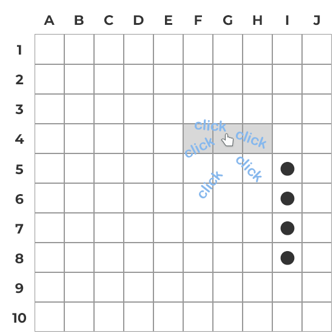

  

__________________________________________________________________________________________________________________________________

# Attention

The site background reflects only the quality of the project (partly) and does not try to offend anyone. Thanks for understanding.

__________________________________________________________________________________________________________________________________

# Game rules

#### 1. Board size fixed - 10x10 cells
#### 2. Ships line up in a straight line, horizontally or vertically

#### 3. Ships cannot be placed on another ship neighbor cells
#### 4. All cells within a radius of 1 from the ship are considered neighbors, including diagonal ones

  
For example

  
  

    
    
  

#### 5. The players take turns. No extra turn after hit

  
For example

  

__________________________________________________________________________________________________________________________________

# Functionality

#### 1. For multiplayer game you should have the host's session key

  
For example

  

#### 2. During ships placing the cells in which the ship will be placed are highlighted

  
For example

  

#### 3. Ship and its direction selecting doing with the buttons

  
For example

  

#### 4. The battle will begin as soon as both players place all ships
#### 5. Player whose turn will be first chooses randomly

  
For example

  

#### 6. During the battle there is the panel with the remaining ships of players

  
For example

  

#### 7. If you will lose, the opponent's remaining ships will be shown on his board
#### 8. At the end of the game interaction with the boards and buttons becomes unavailable

  
For example

  

#### 9. The game can be restarted using the button on the page panel at any state

  
For example

  

#### 10. Game restart is available only to the host

  
For example

  

