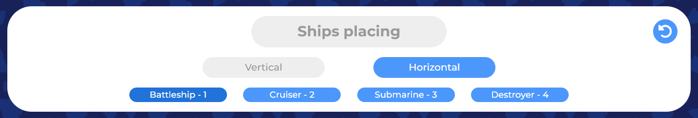

  

________________________________________________________________________________________________________

# Attention

Фон сайта отражает лишь качество проекта (отчасти) и не пытается никого оскорбить. Спасибо за понимание.

________________________________________________________________________________________________________

# Правила игры

#### 1. Размер поля фиксированный – 10х10 клеток
#### 2. Корабли располагаются прямой линией, горизонтально или вертикально

#### 3. Корабли нельзя ставить на соседние клетки другого корабля
#### 4. Соседними считаются все клетки в радиусе 1 от корабля, включая диагональные

  
Визуально

  
  

    
    
  

#### 5. Ходы делаются по очереди. После попадания дополнительный ход не делается

  
Визуально

  

________________________________________________________________________________________________________

# Функциональность

#### 1. Для игры в мультиплеере необходим уникальный ключ сессии хоста

  
Визуально

  

#### 2. Во время выставления кораблей подсвечиваются клетки, в которые корабль будет поставлен

  
Визуально

  

#### 3. Выбор корабля, который игрок хочет поставить, и его направления выполняется кнопками

  
Визуально

  

#### 4. Бой начнётся как только оба игрока выставят все корабли
#### 5. Игрок, чем ход будет первым, выбирается случайно

  
Визуально

  

#### 6. Во время боя отображается количество оставшихся кораблей противника и игрока

  
Визуально

  

#### 7. В случае поражения на доске противника показываются оставшиеся корабли
#### 8. По окончании игры взаимодествие с досками и кнопками становится недоступным

  
Визуально

  

#### 9. На любом этапе игру можно перезапустить с помощью кнопки на панели игры

  
Визуально

  

#### 10. Перезапуск игры доступен только хосту

  
Визуально

  

